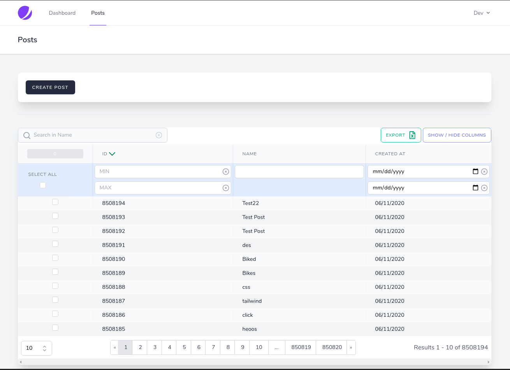
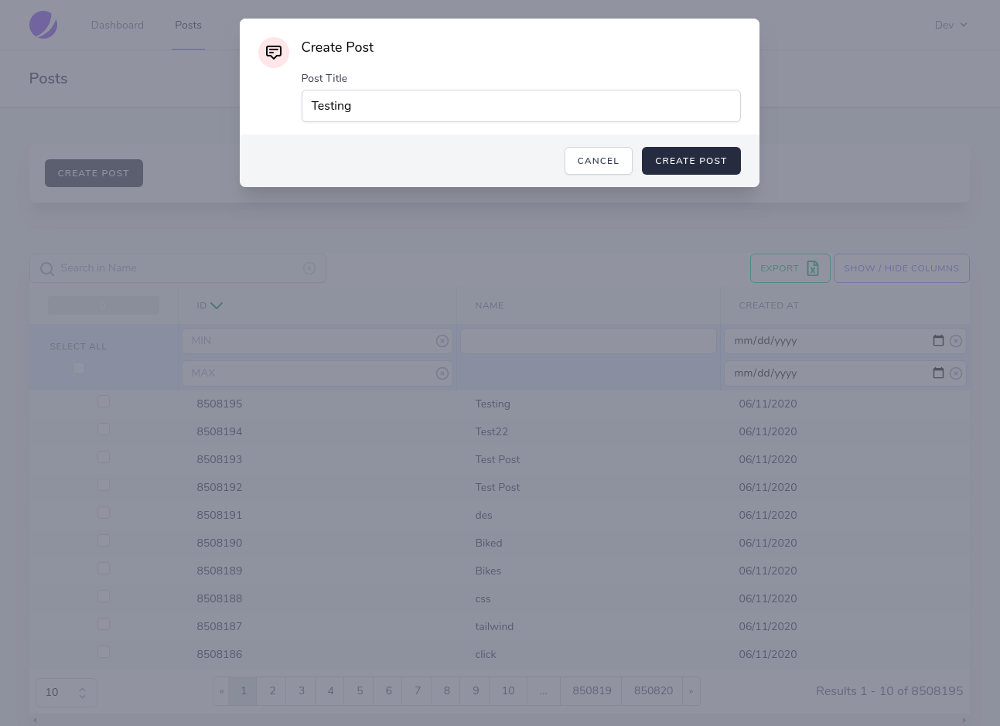

# Jetstream Livewire Datatables

Testing [MedicOneSystems Livewire Datatables](https://github.com/MedicOneSystems/livewire-datatables) on Laravel Jetstream.

# Instructions

1. ` git clone https://github.com/Ammly/jetstream-livewire-datatables.git `
2. ` cd jetstream-livewire-datatables `
3. ` Composer install && npm install && npm run dev`
4. Run migrations and seed db ` php artisan migrate --seed `
5. Modify ` .env ` and start php server ` php artisan serve `

# Screenshots

- All Posts

- create Post Modal

